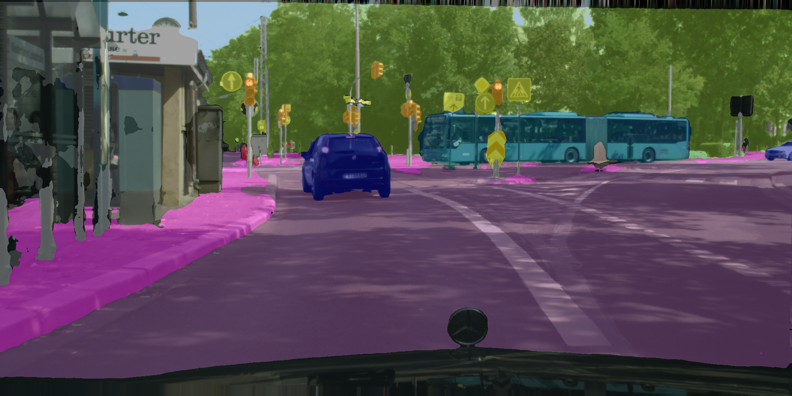
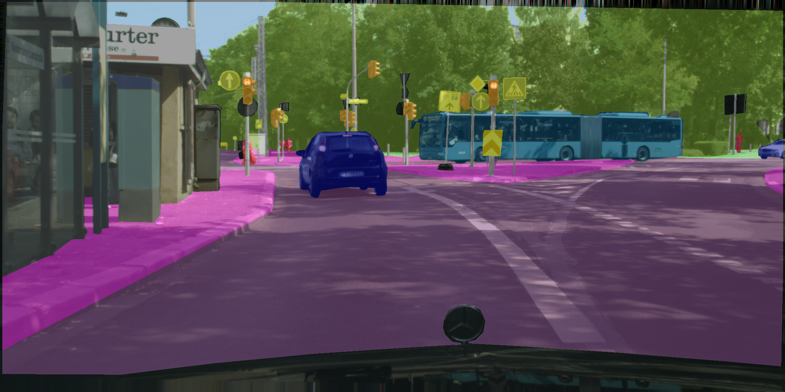

# Image Segmentation on Cityscapes Dataset with SegFormer

In this project (for subject Deep Learning at university) I used SegFormer (smallest b0 version with around 3M parameters) model to perform image segmentation on Cityscapes dataset. 

## Files

- cityscapes_analysis.ipynb: notebook for some dataset analysis and example preview
- segmentation_colors.png: image with colors for each class
- inference_results: folder with some example predictions on validation set
- code:
    - main.py: training 
    - inference.py: inference
    - dataset.py: dataset class
    - metrics.py: metrics class
    - config.py: configuration file for training and inference
    - visualize.py: visualization of results for inference
    - labels.py: labels for each class (taken from cityscapes repo)
    - run.sh: bash script for training
- download_dataset: folder with script for downloading dataset
- checkpoints: folder with checkpoints of best trained models

## Results

You can see report from the best run on [wandb](https://api.wandb.ai/links/dejan-gjer/zh7ursss). This run achived 0.59 mIoU score on validation set and here you can see some examples of predictions on validation set:

    

        
    

    

        
    

Figure 1: Predicted mask (left) and original mask (right) 

